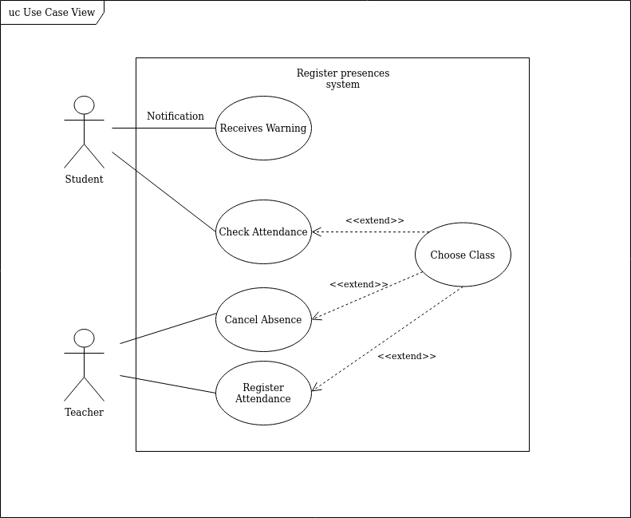
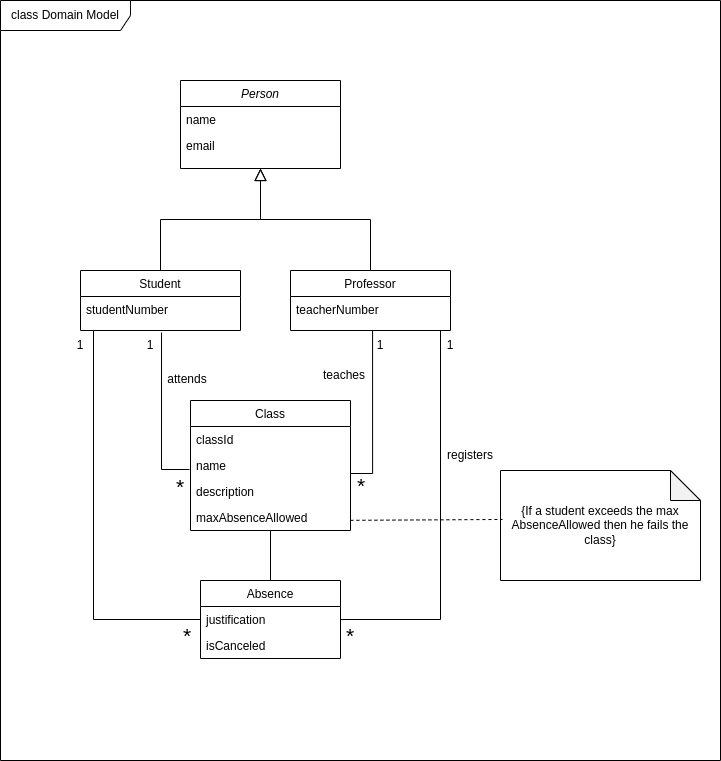

## Requirements

### Use case model

|||
| --- | --- |
| *Name* | Register Attendance |
| *Actor* |  Teacher | 
| *Description* | The teacher registers the attendance of each student. |
| *Preconditions* | - The class needs to be happening at the moment of registration.   - If the class hasn't started yet or if the class has already ended the teacher cannot register the attendance. |
| *Postconditions* | - The attendance is registered and the students missing are notified |
| *Normal flow* | 1. The teacher accesses the app main page of the register system.   2. The teacher selects the class that he wants to register   3. The system shows the list of students in the current class.  4. The teacher selects the students that are missing.   5. The system asks for confirmation. |
| *Alternative flows and exceptions* | 1. [Register failure] If, in step 5 of the normal flow the registration fails, the system gives the teacher the possibility to cancel or retry. |

|||
| --- | --- |
| *Name* | Absence Warning |
| *Actor* |  Teacher | 
| *Description* | If students are close to reaching the maximum number of absences allowed, they receive a notification. |
| *Preconditions* | Student is close to failing class because of absences. |
| *Postconditions* | The student receives the notification. |
| *Normal flow* | 1. The student receives the notification.  2. The notification redirects to the UC page.  3. On the page presented, it will be shown the updated number of absences of the particular UC. |
| *Alternative flows and exceptions* | 1. [Justified absence] If notification has already been sent but absence has been justified, the notification will redirect to an error page telling the user the notification is no longer valid. |

|||
| --- | --- |
| *Name* | Cancel Absence |
| *Actor* |  Teacher | 
| *Description* |If the student is absent and has justification, he can justify and this absence will not be counted.. |
| *Preconditions* | The teacher needs to mark the student's absence from class and the student needs an justification for the absence. |
| *Postconditions* | The absence is not count . |
| *Normal flow* | 1.The teacher marks the absence.  2.The student receives notification of the absence.  3. The student shows willingness to justify the absence. And then, if he is accepted at the secretary's office, the teacher can go and remove the absence. |
| *Alternative flows and exceptions* | 1. [Justification not valid] If the justification is not valid then the fault will continue to be counted|

### Domain Model

#### Classes 
-    Person: This class is a generalization for the Student and Teacher classes which contains the name and the email of all people who may be students or teachers.
-    Student: This class holds the number of each student, and this way the app can separate the students from the teachers.
-    Professor: Contains the number of each professor so that they can access the main app page.
-    Class: Stores all the necessary information from each course unit just like an UC page of sigarra. 
In addition, gives the student the maximum number of absences allowed of the UC.
-    Absence: This class saves the justification of absence of the student if it is valid and this way, the teacher can cancel the absence he gave the student at the time of the lesson.